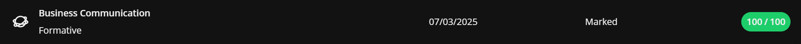
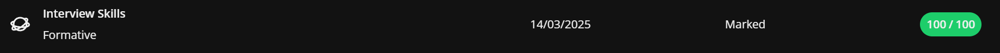
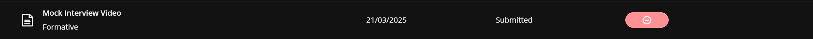
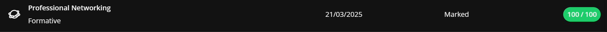
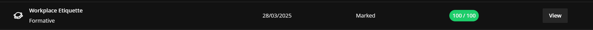

# Digital Portfolio
## Sufyaan Rawoot

### Career Counselling

**Reflection**
* S: I completed a Career Counselling course to explore potential career paths aligned with my goals.
* T: I needed to identify suitable careers based on my strengths and values.
* A: I engaged in guided self-assessments and analysis activities on my what aligns with my interests.
* R: I gained clarity on my career direction and developed a focused plan for my future.

### Skills and Interests

**Reflection**
* S: I completed the Skills and Interests course to better understand what I’m good at and what motivates me.
* T: My task was to identify key skills and interests that align with career opportunities.
* A: I completed various quizzes and reflective exercises to uncover my strengths and weaknesses.
* R: I discovered a clearer connection between my abilities and potential job roles I would enjoy.

### Personality Assessment

**Reflection**
* S: I completed a Personality Assessment course to understand how my personality affects my career choices.
* T: The goal was to evaluate my personality type and how it fits in work environments.
* A: I completed personality tests which allowed me to understand how different work places are geared towards different personality types.
* R: I learned how my personality influences teamwork, decision-making, and career preferences.

### Create A CV

**Reflection**
* S: I completed a course on creating a CV to improve how I present myself to potential employers.
* T: I needed to draft a professional CV that accurately represents my skills and experiences.
* A: I followed structured templates and incorporated feedback to refine my CV.
* R: I produced a polished CV that effectively highlights my strengths and achievements.

### CV Submission

[View my CV](Sufyaan_Rawoot_221075127_CV.pdf)

**Reflection**
* S: I completed a course on how to perfect my CV.
* T: The task was to learn how to make a professional CV.
* A: I practiced using different templates and selected the best one.
* R: I now feel confident in my CV and making a good first impression.

## Business Communication

**Reflection**  
* **S:** I completed a Business Communication course to improve my ability to communicate professionally in workplace environments.  
* **T:** The goal was to develop effective verbal and written communication skills for professional settings.  
* **A:** I learned how to write professional emails, structure business reports, and communicate clearly in meetings and presentations.  
* **R:** I became more confident expressing ideas professionally and improved my overall workplace communication style.  

---

## Interview Skills

**Reflection**  
* **S:** I completed an Interview Skills course to prepare for job interviews and build confidence in presenting myself.  
* **T:** I needed to learn techniques for answering interview questions effectively and professionally.  
* **A:** I practiced mock interviews, studied common interview questions, and refined my answers using feedback from instructors.  
* **R:** I gained confidence, improved my communication under pressure, and learned how to highlight my strengths clearly in interviews.  

---

## Mock Interview

**Reflection**  
* **S:** I participated in a Mock Interview session to apply the skills I learned in the Interview Skills course.  
* **T:** My task was to simulate a real interview environment and practice responding to typical employer questions.  
* **A:** I prepared by researching the company and role, dressed professionally, and used the STAR technique to structure my answers.  
* **R:** The feedback helped me refine my interview style, body language, and responses, boosting my readiness for real job interviews.  

---

## Professional Networking

**Reflection**  
* **S:** I completed a Professional Networking course to understand the importance of building career connections.  
* **T:** I needed to learn how to effectively connect with professionals and use platforms like LinkedIn for career growth.  
* **A:** I created a LinkedIn profile, joined relevant groups, and practiced writing connection requests and professional messages.  
* **R:** I learned how networking opens opportunities for collaboration, mentorship, and future career advancement.  

---

## Workplace Etiquette

**Reflection**  
* **S:** I completed a Workplace Etiquette course to learn about professional behavior in an organizational environment.  
* **T:** The goal was to understand workplace norms, professionalism, and appropriate conduct.  
* **A:** I explored case studies and scenarios on communication, teamwork, and workplace respect, applying them to real-world examples.  
* **R:** I now understand how to maintain professionalism in diverse environments, contributing to positive and respectful workplaces.  

